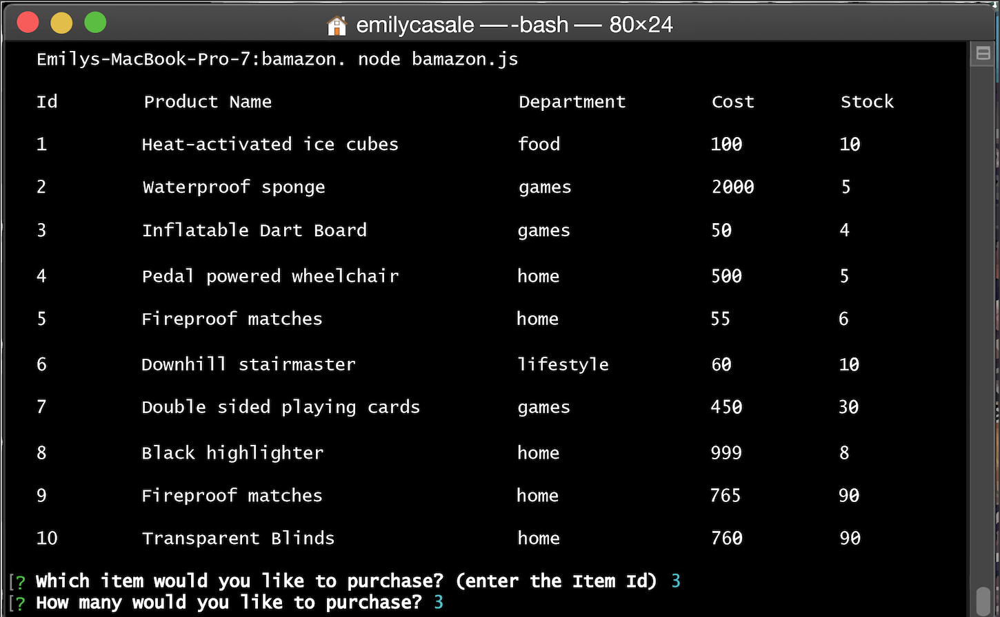
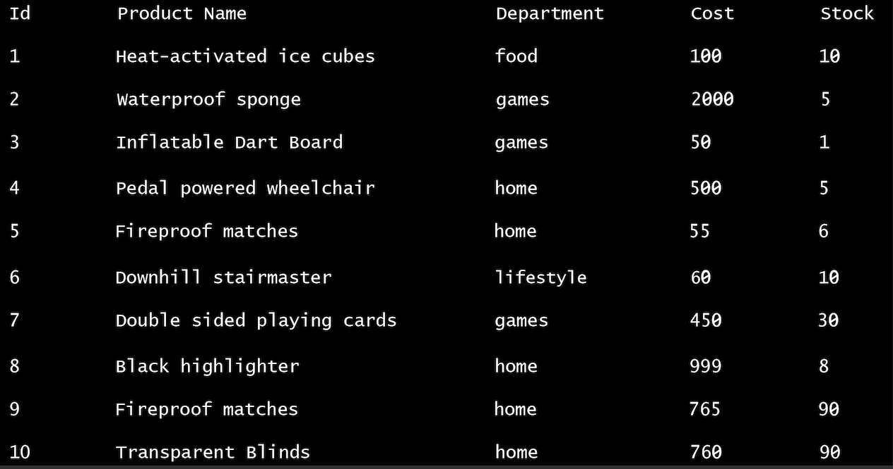
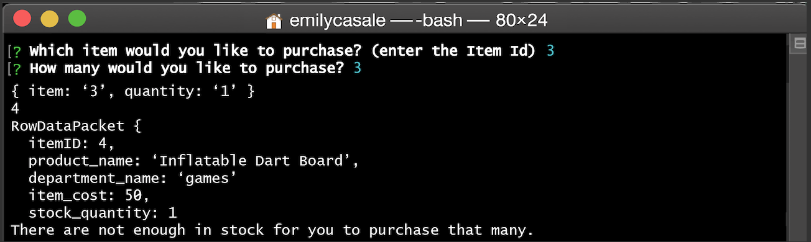

# bamazon.
Welcome to Bamazon. Bamazon has an Amazon-like storefront built with Node.js, MySQL, and the Prompt Package.

Bamazon will take in orders from customers and deplete the store’s total supplies.

Initializing node bamazon.js in the command line will bring up the storefront. It will then ask you what you’d like to purchase by item number and how many:

If there are enough then it will adjust the quantities and continue:

If there are not enough, an error message will occur:

I also used the cli table package to make neater unicode tables. You can download the package at: 
http://www.npmjs.com/package/cli-table
